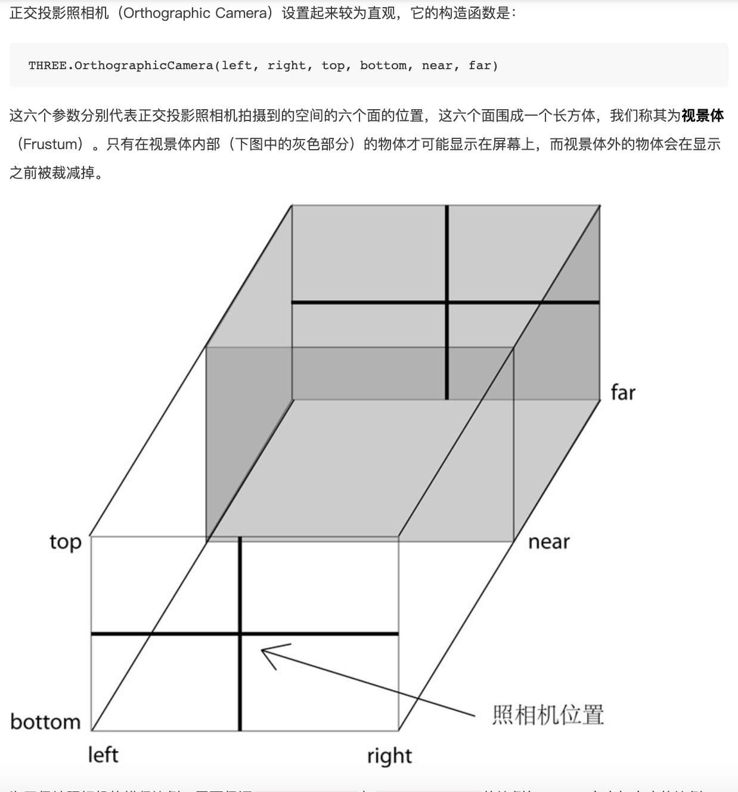
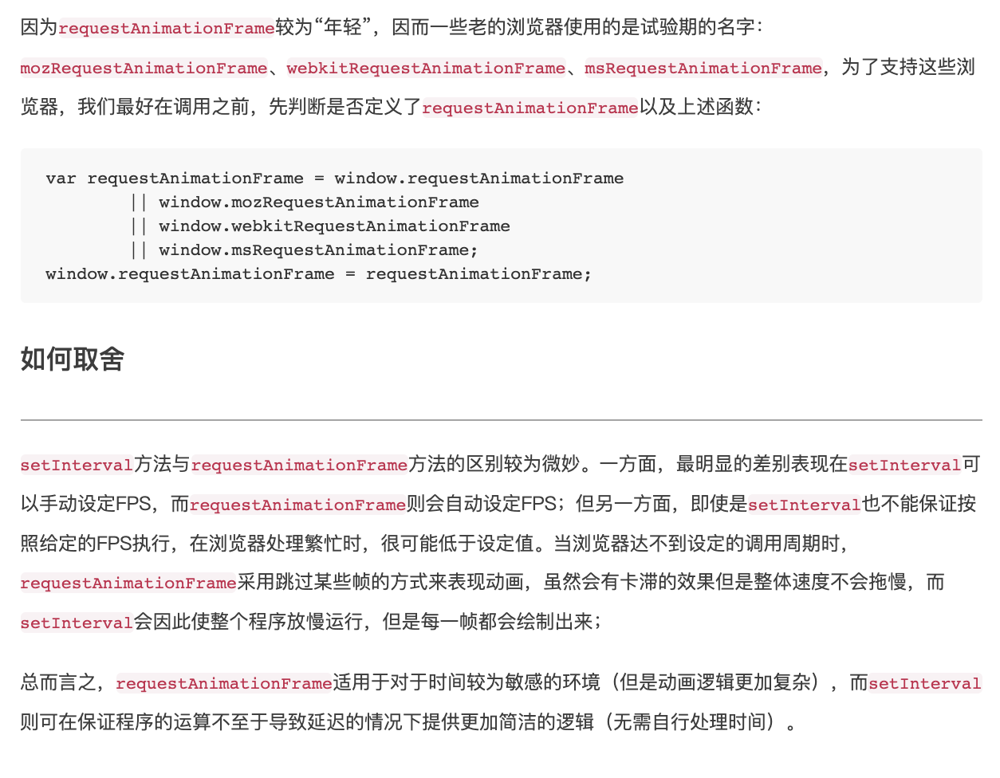

# ThreeJS入门 学习笔记
  * https://www.ituring.com.cn/book/1272

## 概述
  * ThreeJS => WebGL => OpenGL .  封装
  * 代码三要素: 场景 Scene、渲染 Render、照相机 Camera

## 照相机
  * 照相机就是这样一个抽象，它定义了三维空间到二维屏幕的投影方式，用“照相机”这样一个类比，可以使我们直观地理解这一投影方式
  
### 正交相机
  

### 透视相机
  

## 网格
  * 网格就是由材质+几何组成。const mesh = new THREE.Mesh(geometry, material);

## 材质
  * 使用基本材质（BasicMaterial）的物体，渲染后物体的颜色始终为该材质的颜色，而 不会由于光照产生明暗、阴影效果。如果没有指定材质的颜色，则颜色是随机的。
  * Lambert材质 适合有漫反射物体.
  * Phong材质 适合有镜面反射的物体
  * Normal材质，在调试时，要知道物体的法向量，使用法向材质就很有效。

## 动画
  

